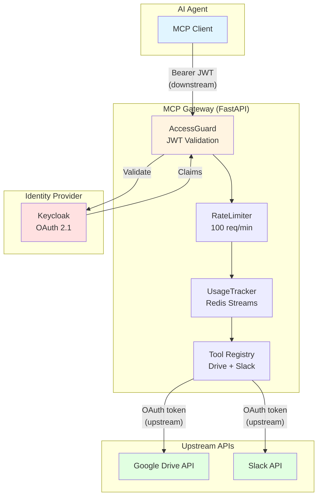

# MCP Agent Gateway

> Secure gateway that gives AI agents audited access to Google Drive and Slack — so teams spend less time switching tools and more time getting work done.

## Why this exists

AI agents need to access multiple external APIs — documents in Google Drive, messages in Slack — but doing this securely is hard. The naive approach (forward the user's JWT to upstream APIs) creates a **Confused Deputy vulnerability**: the agent acts on behalf of a user without proper authorization context.

This gateway solves it with:

- **Two separate OAuth 2.1 flows**: downstream (client → gateway) and upstream (gateway → Drive/Slack)
- **Token isolation**: each user's credentials are encrypted and never shared across integrations
- **Rate limiting**: 100 requests/minute per user (Redis-backed sliding window)
- **Usage tracking**: every tool call logged to Redis Streams for analytics
- **Audit trail**: full visibility into who accessed what, when

## Architecture



**Key principle:** Downstream JWT is **never** forwarded to upstream APIs (Confused Deputy prevention). Each integration gets its own OAuth token, scoped to that specific service.

## Quick Start

### Prerequisites

- Python 3.13+
- [uv](https://docs.astral.sh/uv/) (Python package manager)
- [just](https://github.com/casey/just) (task runner)
- Docker & Docker Compose

### Installation

```bash
# Clone repository
git clone https://github.com/yourusername/mcp-agent-gateway.git
cd mcp-agent-gateway

# Install dependencies
just deps

# Start Keycloak + Redis
just docker-up

# Start development server
just dev
```

Server runs at http://localhost:8000  
Keycloak admin at http://localhost:8080 (admin/admin)  
MCP endpoint at http://localhost:8000/mcp/

### First Request

```bash
# Get JWT from Keycloak (example)
TOKEN=$(curl -s -X POST http://localhost:8080/realms/master/protocol/openid-connect/token \
  -d "grant_type=password" \
  -d "client_id=admin-cli" \
  -d "username=admin" \
  -d "password=admin" | jq -r .access_token)

# Call a tool
curl -X POST http://localhost:8000/mcp/ \
  -H "Authorization: Bearer $TOKEN" \
  -H "Content-Type: application/json" \
  -d '{
    "jsonrpc": "2.0",
    "method": "tools/call",
    "params": {
      "name": "drive-search-files",
      "arguments": {"query": "contract", "max_results": 10}
    },
    "id": 1
  }'
```

## Available Tools

### Google Drive Integration

| Tool | Description | Example Use Case |
|------|-------------|------------------|
| `drive-search-files` | Search files by query | "Find the contract for Acme Corp" |
| `drive-get-file-content` | Download file content | "Read the Q3 report" |
| `drive-list-recent` | List recently modified files | "Show me what changed this week" |

### Slack Integration

| Tool | Description | Example Use Case |
|------|-------------|------------------|
| `slack-send-message` | Send message to channel | "Notify #sales about new lead" |
| `slack-search-messages` | Search message history | "Find discussions about Project X" |

### Async Jobs

| Tool | Description | Example Use Case |
|------|-------------|------------------|
| `job-enqueue` | Enqueue long-running task | "Export large file to Drive" |
| `job-status` | Check job status | "Is the export done?" |
| `job-result` | Retrieve job result | "Get the export URL" |

## Security

### Authentication & Authorization

- **OAuth 2.1 + RFC 9728** (Protected Resource Metadata): standardized discovery for protected resources
- **JWT validation**: RS256 signatures, issuer/audience verification
- **Downstream/upstream separation**: client JWT never forwarded to Google/Slack (Confused Deputy prevention)
- **Dynamic Client Registration**: RFC 7591 for automated client onboarding

### Data Protection

- **Token encryption at rest**: Fernet symmetric encryption for refresh tokens
- **Per-integration keys**: each service has its own encryption secret
- **Defense in depth**: even if Redis is compromised, tokens remain encrypted

### Rate Limiting & Abuse Prevention

- **Redis-backed sliding window**: atomic operations prevent race conditions
- **100 requests/minute per user**: configurable via environment variables
- **429 Too Many Requests**: with `Retry-After` header

### Audit & Compliance

- **Usage tracking**: every tool call logged to Redis Streams
- **Structured logging**: JSON logs with request IDs for tracing
- **Security headers**: HSTS, X-Frame-Options, CSP, etc.
- **Origin guard**: CORS restricted to trusted origins

### Dependency Security

- **pip-audit**: scans for known vulnerabilities in dependencies
- **bandit**: static analysis for security issues
- **CI enforcement**: both run in GitHub Actions pipeline

## Adding a 3rd Integration (e.g., HubSpot)

The gateway is designed to be extensible. To add a new integration:

### 1. Create Integration Module

```bash
# Directory structure
app/integrations/hubspot/
├── __init__.py
├── oauth_flow.py      # OAuth 2.1 flow (authorization URL, callback handler)
├── token_store.py     # Token persistence (Redis + Fernet encryption)
└── hubspot_client.py  # API client (httpx + retry logic)
```

### 2. Implement the UpstreamProvider Contract

```python
# app/integrations/hubspot/hubspot_client.py
from app.integrations.base import UpstreamProvider

class HubSpotClient(UpstreamProvider):
    def __init__(self, user_id: str):
        self.user_id = user_id
        self.token_store = HubSpotTokenStore(user_id)

    async def get_valid_token(self) -> str:
        return await self.token_store.get_valid_token()
```

### 3. Create Tools

```python
# app/gateway/tools/hubspot_tools.py
from app.gateway.server import mcp

@mcp.tool()
async def hubspot_get_contact(email: str) -> dict:
    """Get contact details from HubSpot."""
    client = HubSpotClient(current_user_id.get())
    token = await client.get_valid_token()
    return await http_client.get(f"https://api.hubapi.com/contacts/{email}", headers={"Authorization": f"Bearer {token}"})
```

### 4. Register OAuth Endpoints

```python
# app/authorization/router.py
@router.post("/auth/hubspot/initiate")
async def initiate_hubspot_auth(...):
    return hubspot_oauth_flow.initiate(...)

@router.get("/auth/hubspot/callback")
async def hubspot_callback(...):
    return await hubspot_oauth_flow.handle_callback(...)
```

### 5. Add Configuration

```bash
# .env
HUBSPOT_CLIENT_ID=your_client_id
HUBSPOT_CLIENT_SECRET=your_client_secret
HUBSPOT_TOKEN_ENCRYPTION_KEY=fernet_key_here
```

### 6. Test

```python
# tests/integrations/hubspot/test_hubspot_client.py
async def test_hubspot_get_contact():
    client = HubSpotClient("user-123")
    result = await client.get_valid_token()
    assert isinstance(result, str)
```

## Design Decisions

### 1. Redis vs In-Memory Stores

**Choice:** Redis for rate limiting, usage tracking, and token storage

**Rationale:**
- **Production-ready**: supports horizontal scaling (multiple gateway instances)
- **Atomic operations**: Lua scripts prevent race conditions in rate limiting
- **Persistence**: data survives restarts (important for usage analytics)
- **Streams**: native support for append-only logs (usage tracking)

**Trade-off:** Adds operational complexity vs simple in-memory dicts

### 2. OAuth 2.1 + RFC 9728 vs Custom Auth

**Choice:** Standards-compliant OAuth 2.1 with Protected Resource Metadata

**Rationale:**
- **Interoperability**: any MCP client can connect
- **Security**: spec audited by community, prevents token replay
- **Production-ready**: Keycloak as authorization server (battle-tested)

**Trade-off:** More complex setup vs simple API keys

### 3. Two Separate OAuth Flows

**Choice:** Downstream (client → gateway) and upstream (gateway → Drive/Slack) are completely separate

**Rationale:**
- **Confused Deputy prevention**: downstream JWT never forwarded to upstream APIs
- **Scope isolation**: each integration has its own OAuth scope
- **Audit clarity**: clear separation of "who asked" vs "what was accessed"

**Trade-off:** Users must authorize twice (once for gateway, once for each integration)

### 4. Fernet Encryption vs Plaintext

**Choice:** Fernet symmetric encryption for refresh tokens

**Rationale:**
- **Defense in depth**: even if Redis is compromised, tokens are encrypted
- **Authenticated encryption**: prevents tampering
- **Simple key management**: one key per integration

**Trade-off:** Slight performance overhead vs plaintext storage

### 5. Sliding Window vs Fixed Window Rate Limiting

**Choice:** Sliding window algorithm (Redis-backed)

**Rationale:**
- **Fairness**: prevents burst at window boundaries
- **Predictable**: smooth rate limiting over time
- **Atomic**: Lua script ensures consistency

**Trade-off:** More complex implementation vs fixed window (simple counter)

### 6. Redis Streams vs Logs for Usage Tracking

**Choice:** Redis Streams for usage tracking

**Rationale:**
- **Real-time analytics**: can query recent usage without log parsing
- **Retention policies**: automatic cleanup of old data
- **Consumer groups**: multiple services can process the same stream

**Trade-off:** Requires Redis vs writing to stdout/files

## Development

```bash
# Run tests
just test

# Run tests with coverage
just test-cov

# Lint and format
just lint

# Run full CI pipeline
just ci

# Start Docker services
just docker-up

# Check service health
just health

# Run security scanners
just security
```

## Testing

- **184 tests** passing
- **90% code coverage**
- **Integration tests** with respx (HTTP mocking)
- **Security tests** including Confused Deputy proof

See `COVERAGE.md` for detailed coverage report.

## Deployment

### Docker

```bash
docker build -t mcp-agent-gateway .
docker run -p 8000:8000 mcp-agent-gateway
```

### Environment Variables

```bash
# Required
REDIS_URL=redis://localhost:6379
OAUTH_ISSUER_URL=http://localhost:8080/realms/master
OAUTH_EXPECTED_AUDIENCE=mcp-gateway
GATEWAY_BASE_URL=http://localhost:8000

# Google Drive
GOOGLE_CLIENT_ID=your_client_id
GOOGLE_CLIENT_SECRET=your_client_secret
GOOGLE_TOKEN_ENCRYPTION_KEY=fernet_key_here
GOOGLE_REDIRECT_URI=http://localhost:8000/auth/google/callback

# Slack
SLACK_CLIENT_ID=your_client_id
SLACK_CLIENT_SECRET=your_client_secret
SLACK_TOKEN_ENCRYPTION_KEY=fernet_key_here
SLACK_REDIRECT_URI=http://localhost:8000/auth/slack/callback
```

## Project Structure

```
app/
├── app/
│   ├── main.py                         # FastAPI application bootstrap
│   ├── config.py                       # Pydantic settings
│   ├── logging.py                      # Structured logging config
│   ├── authorization/
│   │   └── router.py                   # OAuth endpoints (authorize, callbacks)
│   ├── identity/
│   │   ├── token_validator.py          # JWT validation (RS256, JWKS)
│   │   ├── jwks_client.py             # JWKS client with TTL cache
│   │   ├── protected_resource.py      # RFC 9728 metadata endpoint
│   │   └── client_registration/       # DCR (RFC 7591)
│   ├── gateway/
│   │   ├── server.py                   # MCP session manager
│   │   ├── mcp.py                      # MCP ASGI app + lifespan
│   │   ├── event_store.py             # Event replay for resumability
│   │   ├── health.py                   # Health check endpoint
│   │   ├── jobs.py                     # Async job queue
│   │   ├── job_worker.py              # Job worker process
│   │   ├── usage.py                    # Usage tracking logic
│   │   ├── usage_router.py            # Usage stats API
│   │   ├── webhooks_router.py         # Webhook endpoints
│   │   ├── middleware/
│   │   │   ├── access_guard.py        # Bearer JWT validation
│   │   │   ├── rate_limiter.py        # Sliding window rate limit
│   │   │   ├── request_logger.py      # Request ID + timing
│   │   │   ├── security_headers.py    # HSTS, CSP, etc.
│   │   │   └── origin_guard.py        # CORS validation
│   │   └── tools/
│   │       ├── drive_tools.py         # Google Drive MCP tools
│   │       ├── slack_tools.py         # Slack MCP tools
│   │       └── job_tools.py           # Async job MCP tools
│   ├── integrations/
│   │   ├── base.py                     # UpstreamProvider ABC
│   │   ├── google/
│   │   │   ├── drive_client.py        # Google Drive API client
│   │   │   ├── oauth_flow.py          # Google OAuth 2.1 flow
│   │   │   ├── token_store.py         # Token persistence (Fernet)
│   │   │   └── constants.py           # Google API constants
│   │   └── slack/
│   │       ├── slack_client.py        # Slack API client
│   │       ├── oauth_flow.py          # Slack OAuth flow
│   │       ├── token_store.py         # Token persistence (Fernet)
│   │       ├── signature.py           # Webhook signature verification
│   │       └── constants.py           # Slack API constants
│   └── shared/
│       ├── store.py                    # RedisStore + token stores
│       ├── redis.py                    # Redis connection factory
│       ├── http_client.py             # Shared async HTTP client
│       ├── exceptions.py              # Domain exceptions
│       └── dependencies.py            # FastAPI dependencies
├── tests/                              # Test suite (mirrors app/)
├── docker-compose.local.yml           # Local development services
├── docker-compose.production.yml      # Production deployment
├── Justfile                            # Developer commands
├── COVERAGE.md                        # Test coverage report
└── README.md                          # This file
```

## License

MIT

## Contributing

Contributions welcome! Please:

1. Fork the repository
2. Create a feature branch
3. Make your changes
4. Run `just ci` to ensure tests pass
5. Submit a pull request

---

**Built with:** FastAPI, Redis, Keycloak, Google Drive API, Slack API, MCP 2025-11-25
