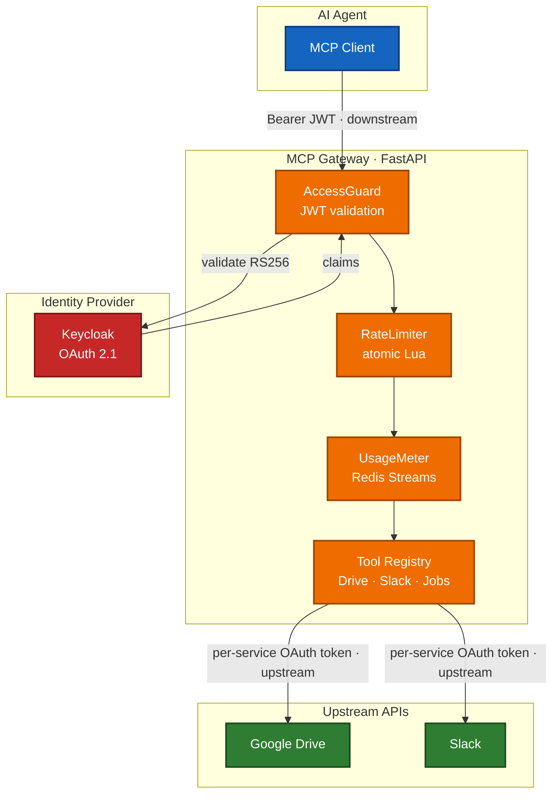

# MCP Agent Gateway

> A secure, production-grade gateway that gives AI agents **audited, least-privilege access** to Google Drive and Slack over the Model Context Protocol — without ever leaking the user's identity token to a third party.

<p align="center">
  
  
  
  
  
</p>

<p align="center">
  
  
  
  
  
  
</p>

---

## The problem this solves

AI agents want to read your Drive and post to your Slack. The naïve way — forward the
user's bearer token straight to the upstream API — is a textbook **Confused Deputy
vulnerability**: the upstream can't tell whether the agent was actually authorized to act,
and a single stolen token unlocks everything.

This gateway refuses to do that. It runs **two independent OAuth 2.1 trust boundaries**:

```
 Agent ──Bearer JWT──▶  GATEWAY  ──per-service OAuth token──▶  Google / Slack
        (downstream)      │                  (upstream)
                          └── the downstream JWT is NEVER forwarded upstream
```

The separation is **proven by a regression test** (`test_confused_deputy`) that asserts the
downstream JWT never appears in any upstream request — so the guarantee can't silently rot.

---

## Highlight reel

| What | How it's done | Why it's hard |
|---|---|---|
| 🛡️ **Confused Deputy prevention** | Dual OAuth flows, per-integration token mint | Most gateways forward the caller's token by default |
| 🔑 **Standards-based auth** | OAuth 2.1 + RFC 9728 PRM + RFC 7591 Dynamic Client Registration | Any compliant MCP client connects with zero custom glue |
| 🔒 **Tokens encrypted at rest** | Fernet (authenticated encryption), one key per provider | Redis compromise ≠ credential compromise |
| ⏱️ **Atomic rate limiting** | Sliding window in a single Redis **Lua** script | Naïve counters race under concurrency |
| 📈 **Usage metering** | `tiktoken` token counting → Redis Streams + admin API | Per-user cost/visibility without log scraping |
| ⚙️ **Async job queue** | Redis Streams consumer groups + ownership guard | Large Drive exports outlive a single request |
| 📨 **Signed webhooks** | Slack HMAC v0 + timestamp freshness + replay guard + idempotency | Webhooks are a classic spoofing/replay vector |
| 🔭 **Distributed tracing** | OpenTelemetry zero-code auto-instrumentation (FastAPI + httpx), OTLP export, trace-id stamped on every log line | Correlating a request across middleware, MCP, and upstream calls is otherwise guesswork |
| 🧱 **Clean DDD architecture** | Bounded contexts: `identity` / `gateway` / `integrations` / `shared` | New integration = one folder, one contract |

---

## Architecture



**Request path:** `AccessGuard` (Bearer → validate → `request.state.user`; bypasses `/health`
and `/.well-known/*`) → `request_logger` → MCP app at `/mcp/`. Middleware wraps the MCP route
itself, so the protocol traffic is authenticated like everything else.

---

## Capabilities

### Google Drive
| Tool | Does |
|---|---|
| `drive-search-files` | Search files by query / MIME type |
| `drive-get-file-content` | Fetch a file's content |
| `drive-list-recent` | List recently modified files |
| `drive-export-large-file` | Enqueue a large export as an async job |

> [!NOTE]
> **One-time human consent is required — by design, because this runs against a
> free @gmail.com account.** Google only lets apps skip per-user consent through
> domain-wide delegation (Workspace-only), and a service account on a consumer
> account can't see the owner's Drive root. So a one-time OAuth consent from the
> owner is unavoidable — but it happens out-of-band in `gcloud`, not in the gateway.
>
> Consent is not the same as sharing the password: the owner grants scoped,
> read-only (`drive.readonly`), revocable access once, and the gateway only ever
> stores an encrypted refresh token in Redis.
>
> **Provisioning (once):**
>
> ```bash
> # Build the client-id-file from the env vars already in your .env — no download needed.
> echo "{\"installed\":{\"client_id\":\"$GOOGLE_CLIENT_ID\",\"client_secret\":\"$GOOGLE_CLIENT_SECRET\",\"redirect_uris\":[\"http://localhost\"],\"auth_uri\":\"https://accounts.google.com/o/oauth2/auth\",\"token_uri\":\"https://oauth2.googleapis.com/token\"}}" \
>   > google_oauth_client.json
>
> # The refresh token MUST be issued to the SAME OAuth client the gateway refreshes
> # with (GOOGLE_CLIENT_ID/SECRET) — Desktop-type client supports the loopback flow gcloud uses.
> gcloud auth application-default login \
>   --client-id-file=google_oauth_client.json \
>   --scopes=https://www.googleapis.com/auth/drive.readonly,https://www.googleapis.com/auth/cloud-platform
>
> rm google_oauth_client.json
>
> # Copy the refresh_token from the saved ADC file into .env:
> python3 -c "import json,pathlib; d=json.loads(pathlib.Path('~/.config/gcloud/application_default_credentials.json').expanduser().read_text()); print('GOOGLE_SHARED_REFRESH_TOKEN=' + d['refresh_token'])"
> ```
>
> On boot the gateway seeds `token:google:shared` from `GOOGLE_SHARED_REFRESH_TOKEN`
> (only if absent), and `get_valid_google_token` refreshes it on the first Drive
> call. After that, any gateway-authenticated user can use the Drive tools.

### Slack
| Tool | Does |
|---|---|
| `slack-send-message` | Post a message to a channel |
| `slack-search-messages` | Search message history |

### Jobs
| Tool | Does |
|---|---|
| `wait-for-job` | Block on an async job until it completes (ownership-checked) |

Inbound: `POST /webhooks/slack` — HMAC-verified, replay-guarded, idempotent fan-out to a
`events:slack` stream.

> [!NOTE]
> **Bot token via env var — no per-user consent needed (unlike Drive).** A Slack
> bot token (`xoxb-`) is workspace-level: it represents the app, not a person, so
> a single shared token is the natural model — and Slack imposes **no app-review
> or verification gate** for a single-workspace install, so this works on the
> **free Slack plan**.
>
> **Provisioning (once):**
> 1. Create an app at [api.slack.com/apps](https://api.slack.com/apps).
> 2. Add a **Bot User** and the bot scopes the tools need (e.g. `chat:write`,
>    `channels:read`, `search:read`).
> 3. **Install to Workspace** — you approve it yourself as workspace admin; no
>    Slack review.
> 4. Copy the **Bot User OAuth Token** (`xoxb-…`) into `.env` as
>    `SLACK_SHARED_BOT_TOKEN`.
>
> On boot the gateway seeds `slack:token:shared` from `SLACK_SHARED_BOT_TOKEN`
> and `SLACK_SHARED_USER_TOKEN` (only if absent — rotation-safe), mirroring the
> Drive `google:shared` seed. Token rotation is **off by default**, so the tokens
> do not expire — no refresh logic required. The Slack tools always resolve this
> shared identity (`_SLACK_SHARED_USER`), just as the Drive tools resolve
> `_GOOGLE_SHARED_USER`.
>
> Add `SLACK_SHARED_USER_TOKEN` (`xoxp-…`, scope `search:read`) alongside the bot
> token so `slack-search-messages` works — `search.messages` rejects bot tokens.
> Both are Fernet-encrypted at rest, so `SLACK_TOKEN_ENCRYPTION_KEY` must be set
> whenever a shared token is provisioned.
>
> The per-user 3-legged OAuth flow (`/auth/slack/initiate` → callback) stays the
> right choice only when a tool must act **as a specific user** (`xoxp-` user
> token) rather than as the bot.

---

## Security posture

Audited (latest run, this codebase):

- **`pip-audit`** → 0 known dependency vulnerabilities
- **`bandit`** static analysis → 0 high, 0 medium-critical (only low-severity false positives on OAuth URL constants)
- **62 dedicated security tests** green, including the Confused Deputy proof and `verify=True` (TLS) assertions on every outbound HTTP client

Built-in defenses:

- **OAuth 2.1 + RFC 9728** protected-resource discovery; **RS256** JWT validation with JWKS TTL cache
- **Dynamic Client Registration (RFC 7591)** for hands-off client onboarding
- **Fernet** token encryption at rest, per-provider keys
- **OriginGuard** (DNS-rebinding defense on `/mcp`), **SecurityHeaders** (HSTS, nosniff), restricted **CORS**
- **SensitiveDataFilter** masks tokens in structured logs; **OpenTelemetry** traces (FastAPI + httpx auto-instrumented, OTLP) correlate every log line by trace-id
- CI runs `bandit` + `pip-audit` on every push

---

## Quick start

```bash
just deps        # uv sync
just docker-up   # Keycloak + Redis
just dev         # uvicorn --reload
```

Gateway → http://localhost:8000 · MCP → http://localhost:8000/mcp/ · Keycloak → http://localhost:8080

```bash
# get a token, then call a tool
TOKEN=$(curl -s -X POST http://localhost:8080/realms/master/protocol/openid-connect/token \
  -d grant_type=password -d client_id=admin-cli -d username=admin -d password=admin | jq -r .access_token)

curl -X POST http://localhost:8000/mcp/ \
  -H "Authorization: Bearer $TOKEN" -H "Content-Type: application/json" \
  -d '{"jsonrpc":"2.0","method":"tools/call","id":1,
       "params":{"name":"drive-search-files","arguments":{"query":"contract","max_results":10}}}'
```

### Seed users & access (local RBAC)

The local Keycloak realm (`mcp-gateway`) is seeded with three test users. Access to
each integration's MCP tools is gated by a per-client role — `drive-user` unlocks the
Drive tools, `slack-user` unlocks the Slack tools. A user only sees the tools their
roles grant.

| User | Password | Roles | Drive tools | Slack tools |
|---|---|---|---|---|
| `june` | `june-pass` | `drive-user` | ✅ | ❌ |
| `rayray` | `rayray-pass` | `drive-user`, `slack-user` | ✅ | ✅ |
| `jasmine` | `jasmine-pass` | `slack-user` | ❌ | ✅ |

```bash
# log in as a seed user (mcp-gateway realm) and call a tool with that user's scope
TOKEN=$(curl -s -X POST http://localhost:8080/realms/mcp-gateway/protocol/openid-connect/token \
  -d grant_type=password -d client_id=mcp-gateway \
  -d username=rayray -d password=rayray-pass | jq -r .access_token)
```

> Seeded from `compose/local/keycloak/realm.json` (and `seed_rbac.py`). Edit those to
> change the roster, then re-run `just docker-up`.

---

## Extensibility — add an integration in one folder

Every upstream implements one contract:

```python
# app/integrations/base.py
class UpstreamProvider(ABC):
    @abstractmethod
    async def get_valid_token(self, user_id: str) -> str: ...
```

Drop in `app/integrations/{provider}/` with `oauth_flow.py`, `token_store.py`,
`{provider}_client.py`, register a tool module under `app/gateway/tools/`, add config keys —
done. The same dual-OAuth, encryption, and rate-limit guarantees apply automatically.
HubSpot is the next planned provider.

---

## Engineering decisions (the short version)

| Decision | Choice | Because |
|---|---|---|
| State backend | **Redis** (`Store` protocol abstracts it; `InMemoryStore` for tests) | Horizontal scale, atomic Lua, native Streams |
| Auth | **OAuth 2.1 + RFC 9728**, not API keys | Interoperable, replay-resistant, audited spec |
| Trust model | **Two separate OAuth flows** | Confused-Deputy prevention + scope isolation |
| Token storage | **Fernet** authenticated encryption | Defense in depth; tamper-evident |
| Rate limiting | **Sliding window** in Lua | Fair across window boundaries, race-free |
| Usage tracking | **Redis Streams** | Real-time queryable, consumer groups, retention |

---

## Quality

- **184 tests** passing · **90%** coverage (`respx`-mocked HTTP, security regression suite) — see [`COVERAGE.md`](COVERAGE.md)
- **Ruff** lint + format clean (`E,F,I,N,W,UP`, line-length 120)
- Python **3.13**, `uv` package manager
- `just ci` runs the full gate locally

```bash
just test       # pytest
just test-cov   # + coverage
just lint       # ruff check + format
just security   # bandit + pip-audit
just ci         # everything
```

---

## Tech stack

<p>
  
  
  
  
  
  
  
  
  
</p>

Also: **httpx** + **tenacity** (resilient upstream calls) · **PyJWT** (RS256/JWKS) · **cryptography** (Fernet) · **tiktoken** (token counting) · **structlog** (JSON logs).

---

## Observability — necessary improvements

The goal is to **follow a user's journey end-to-end** — both the requests that
succeed and the ones that fail. We have two halves of the picture, and they are
not yet joined.

### What already works

- **Structured request log.** The middleware emits one JSON event per request
  (`method`, `path`, `status`, `duration_ms`, `request_id`, `trace_id`,
  `span_id`), and a sensitive-data filter scrubs bearer/Slack/refresh tokens.
- **OpenTelemetry is wired and running.** The containers start under
  `opentelemetry-instrument` (`compose/*/fastapi/start`), with FastAPI and httpx
  auto-instrumentation and an OTLP/HTTP exporter. This means, for free:
  - a **server span per request**,
  - a **client span per upstream call** (Drive/Slack) carrying the upstream
    status and latency — so "what did the upstream do" is already captured *in
    traces*, even though the clients log nothing,
  - `trace_id`/`span_id` already stamped onto the request log event, so that one
    line is trace-correlated today.

So the upstream-visibility and request-correlation gaps are largely solved **at
the trace layer**. The work left is to make the rest of the journey — identity,
the tool that ran, logical failures, and the scattered logs — correlate too.

### What still needs adjusting, even with OTel on

OTel does not magically enrich anything (it is a delivery mechanism, not a
decision about *what* to record). These remain to be done:

1. **Enrich the span with journey context.** The server span exists but is bare.
   Grab `get_current_span()` and set `user.id`, `mcp.tool`, `mcp.provider`,
   `scopes`, `auth.result`. Without these, traces show *that* a request happened,
   never *who* did *what*.
2. **Mark logical failures on the span.** MCP errors return as a JSON-RPC error
   inside an HTTP `200`, so neither the status code nor the auto-span reflects
   them. Tool handlers must call `span.record_exception(...)` +
   `span.set_status(ERROR)` so a failed tool call shows up as an error trace
   despite the 200.
3. **Make auth failures observable.** `AccessGuard` returns `401` before the
   request-logging middleware runs, so rejected requests produce **zero log
   lines**. Set `auth.result`/error status on the span *and* emit a log event on
   every `401` with a reason (`no_bearer`, `invalid_token`, validation class).
4. **Correlate the scattered logs.** Usage, rate-limiter, job-worker, and
   Slack-OAuth-callback logs carry no `trace_id`/`user.id`, so they can't be
   joined to the request. Turn on the distro's log correlation
   (`OTEL_PYTHON_LOG_CORRELATION=true`) to auto-stamp `otelTraceID`/`otelSpanID`
   onto every log record — one env var, no call-site changes.
5. **Record the success paths, not just failures.** Rate-limit blocks, completed
   export jobs, and successful OAuth callbacks log only on failure today; add the
   success side as span events/attributes so the happy path is queryable too.

Net effect: every request becomes one trace that carries identity, the
tool/integration touched, the upstream result, and any error — with all logs
correlated to it — for both the journeys that succeed and the ones that fail.

## License

MIT
