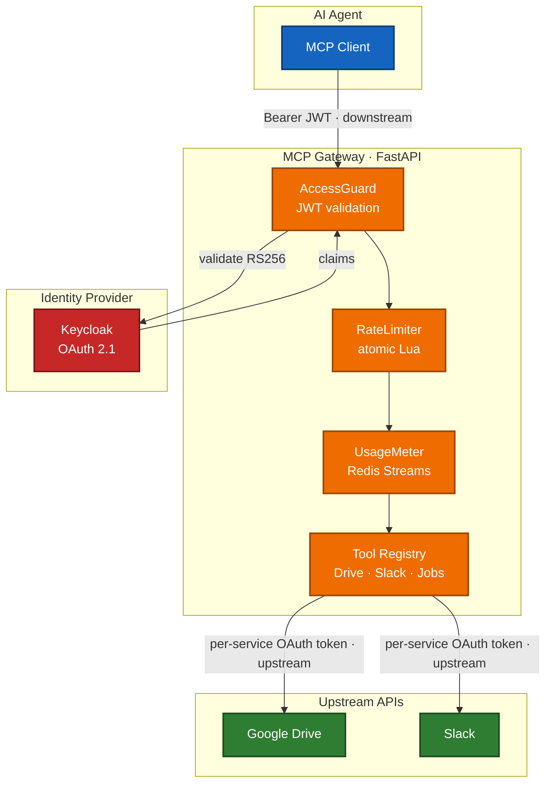

# MCP Agent Gateway

> A secure, production-grade gateway that gives AI agents **audited, least-privilege access** to Google Drive and Slack over the Model Context Protocol — without ever leaking the user's identity token to a third party.

<p align="center">
  
  
  
  
  
</p>

<p align="center">
  
  
  
  
  
  
</p>

---

## The problem this solves

AI agents want to read your Drive and post to your Slack. The naïve way — forward the
user's bearer token straight to the upstream API — is a textbook **Confused Deputy
vulnerability**: the upstream can't tell whether the agent was actually authorized to act,
and a single stolen token unlocks everything.

This gateway refuses to do that. It runs **two independent OAuth 2.1 trust boundaries**:

```
 Agent ──Bearer JWT──▶  GATEWAY  ──per-service OAuth token──▶  Google / Slack
        (downstream)      │                  (upstream)
                          └── the downstream JWT is NEVER forwarded upstream
```

The separation is **proven by a regression test** (`test_confused_deputy`) that asserts the
downstream JWT never appears in any upstream request — so the guarantee can't silently rot.

---

## Highlight reel

| What | How it's done | Why it's hard |
|---|---|---|
| 🛡️ **Confused Deputy prevention** | Dual OAuth flows, per-integration token mint | Most gateways forward the caller's token by default |
| 🔑 **Standards-based auth** | OAuth 2.1 + RFC 9728 PRM + RFC 7591 Dynamic Client Registration | Any compliant MCP client connects with zero custom glue |
| 🔒 **Tokens encrypted at rest** | Fernet (authenticated encryption), one key per provider | Redis compromise ≠ credential compromise |
| ⏱️ **Atomic rate limiting** | Sliding window in a single Redis **Lua** script | Naïve counters race under concurrency |
| 📈 **Usage metering** | `tiktoken` token counting → Redis Streams + admin API | Per-user cost/visibility without log scraping |
| ⚙️ **Async job queue** | Redis Streams consumer groups + ownership guard | Large Drive exports outlive a single request |
| 📨 **Signed webhooks** | Slack HMAC v0 + timestamp freshness + replay guard + idempotency | Webhooks are a classic spoofing/replay vector |
| 🔭 **Distributed tracing** | OpenTelemetry zero-code auto-instrumentation (FastAPI + httpx), OTLP export, trace-id stamped on every log line | Correlating a request across middleware, MCP, and upstream calls is otherwise guesswork |
| 🧱 **Clean DDD architecture** | Bounded contexts: `identity` / `gateway` / `integrations` / `shared` | New integration = one folder, one contract |

---

## Architecture



**Request path:** `AccessGuard` (Bearer → validate → `request.state.user`; bypasses `/health`
and `/.well-known/*`) → `request_logger` → MCP app at `/mcp/`. Middleware wraps the MCP route
itself, so the protocol traffic is authenticated like everything else.

---

## Capabilities

### Google Drive
| Tool | Does |
|---|---|
| `drive-search-files` | Search files by query / MIME type |
| `drive-get-file-content` | Fetch a file's content |
| `drive-list-recent` | List recently modified files |
| `drive-export-large-file` | Enqueue a large export as an async job |

### Slack
| Tool | Does |
|---|---|
| `slack-send-message` | Post a message to a channel |
| `slack-search-messages` | Search message history |

### Jobs
| Tool | Does |
|---|---|
| `wait-for-job` | Block on an async job until it completes (ownership-checked) |

Inbound: `POST /webhooks/slack` — HMAC-verified, replay-guarded, idempotent fan-out to a
`events:slack` stream.

---

## Security posture

Audited (latest run, this codebase):

- **`pip-audit`** → 0 known dependency vulnerabilities
- **`bandit`** static analysis → 0 high, 0 medium-critical (only low-severity false positives on OAuth URL constants)
- **62 dedicated security tests** green, including the Confused Deputy proof and `verify=True` (TLS) assertions on every outbound HTTP client

Built-in defenses:

- **OAuth 2.1 + RFC 9728** protected-resource discovery; **RS256** JWT validation with JWKS TTL cache
- **Dynamic Client Registration (RFC 7591)** for hands-off client onboarding
- **Fernet** token encryption at rest, per-provider keys
- **OriginGuard** (DNS-rebinding defense on `/mcp`), **SecurityHeaders** (HSTS, nosniff), restricted **CORS**
- **SensitiveDataFilter** masks tokens in structured logs; **OpenTelemetry** traces (FastAPI + httpx auto-instrumented, OTLP) correlate every log line by trace-id
- CI runs `bandit` + `pip-audit` on every push

---

## Quick start

```bash
just deps        # uv sync
just docker-up   # Keycloak + Redis
just dev         # uvicorn --reload
```

Gateway → http://localhost:8000 · MCP → http://localhost:8000/mcp/ · Keycloak → http://localhost:8080

```bash
# get a token, then call a tool
TOKEN=$(curl -s -X POST http://localhost:8080/realms/master/protocol/openid-connect/token \
  -d grant_type=password -d client_id=admin-cli -d username=admin -d password=admin | jq -r .access_token)

curl -X POST http://localhost:8000/mcp/ \
  -H "Authorization: Bearer $TOKEN" -H "Content-Type: application/json" \
  -d '{"jsonrpc":"2.0","method":"tools/call","id":1,
       "params":{"name":"drive-search-files","arguments":{"query":"contract","max_results":10}}}'
```

---

## Extensibility — add an integration in one folder

Every upstream implements one contract:

```python
# app/integrations/base.py
class UpstreamProvider(ABC):
    @abstractmethod
    async def get_valid_token(self, user_id: str) -> str: ...
```

Drop in `app/integrations/{provider}/` with `oauth_flow.py`, `token_store.py`,
`{provider}_client.py`, register a tool module under `app/gateway/tools/`, add config keys —
done. The same dual-OAuth, encryption, and rate-limit guarantees apply automatically.
HubSpot is the next planned provider.

---

## Engineering decisions (the short version)

| Decision | Choice | Because |
|---|---|---|
| State backend | **Redis** (`Store` protocol abstracts it; `InMemoryStore` for tests) | Horizontal scale, atomic Lua, native Streams |
| Auth | **OAuth 2.1 + RFC 9728**, not API keys | Interoperable, replay-resistant, audited spec |
| Trust model | **Two separate OAuth flows** | Confused-Deputy prevention + scope isolation |
| Token storage | **Fernet** authenticated encryption | Defense in depth; tamper-evident |
| Rate limiting | **Sliding window** in Lua | Fair across window boundaries, race-free |
| Usage tracking | **Redis Streams** | Real-time queryable, consumer groups, retention |

---

## Quality

- **184 tests** passing · **90%** coverage (`respx`-mocked HTTP, security regression suite) — see [`COVERAGE.md`](COVERAGE.md)
- **Ruff** lint + format clean (`E,F,I,N,W,UP`, line-length 120)
- Python **3.13**, `uv` package manager
- `just ci` runs the full gate locally

```bash
just test       # pytest
just test-cov   # + coverage
just lint       # ruff check + format
just security   # bandit + pip-audit
just ci         # everything
```

---

## Tech stack

<p>
  
  
  
  
  
  
  
  
  
</p>

Also: **httpx** + **tenacity** (resilient upstream calls) · **PyJWT** (RS256/JWKS) · **cryptography** (Fernet) · **tiktoken** (token counting) · **structlog** (JSON logs).

## License

MIT
