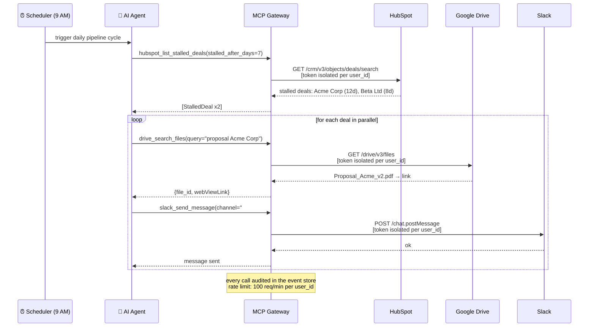
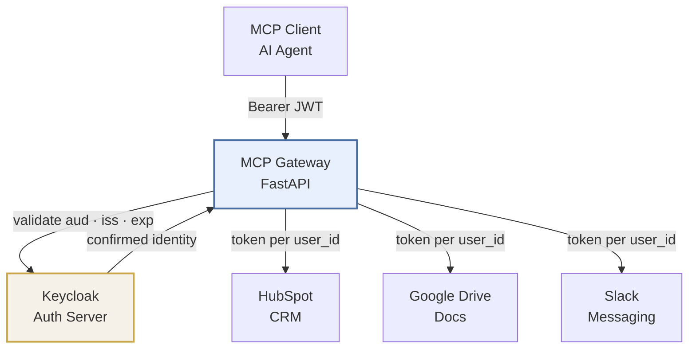

# MCP Agent Gateway

> A secure gateway that gives AI agents audited access to HubSpot, Google Drive, and Slack — so sales reps spend less time switching tools and more time with customers.

## Why this exists

### The problem

A mid-size sales company has 20 reps. Before every important meeting, each one runs the same manual sequence: opens HubSpot to check the customer's history, opens Google Drive to find the proposal sent last week, and messages the manager on Slack to say the meeting is happening.

Three tools, three context switches. 20 reps, 5 meetings per day each. **300 daily context switches that generate zero value** — draining attention from people who should be focused on the customer.

The pain compounds at follow-up time. Deals stall because nobody noticed the proposal was sent 10 days ago with no reply. No alert. No automation. Just a tracking spreadsheet nobody updates.

### Why "just connect an AI to the APIs" doesn't work

The obvious answer is to put an AI agent in front of HubSpot, Drive, and Slack. The problem is that doing it securely is where most projects break:

- **Credential isolation:** with a shared API key, the agent acting for rep Carlos can access rep Ana's data.
- **Confused Deputy:** if the agent forwards the user's token directly to external APIs, it acts on someone's behalf without being specifically authorized for that action on that service.
- **No rate limiting:** a buggy agent sweeps the entire HubSpot and burns the company's API quota.
- **No audit trail:** when something goes wrong, there's no way to know which agent did what, with whose token, and when.

### What this gateway solves

The gateway sits between the AI agent and the company's tools. It does one thing and does it right: **ensures the agent accesses the right data, for the right user, within the right limits, and leaves a full audit trail.**

- The agent presents a token identifying rep Carlos. The gateway validates that token, extracts the identity, and only then retrieves Carlos's HubSpot token — never reusing another user's credential.
- If the agent tries to make more than 100 calls per minute, the gateway returns 429 and protects the API quota for the other reps.
- Every tool call produces an event in the audit log: who requested it, which tool, when, how many tokens were consumed.

### The workflow this showcase demonstrates



Every morning at 9 AM, the agent runs this cycle. Rep Carlos opens Slack and knows exactly what needs attention — with a direct link to the proposal — before his first coffee.

Before a meeting, Carlos asks the agent for a pre-call briefing. The agent calls `hubspot_get_meeting_briefing`, retrieves the contact's history, current deal stage, and last recorded note, and returns a natural-language summary. After the meeting, Carlos dictates the outcome. The agent logs the note to the right deal via `hubspot_log_meeting_outcome` — without Carlos ever opening HubSpot.

## Architecture



Two OAuth flows, completely separate. The token a client presents to the gateway is never forwarded to HubSpot, Drive, or Slack — doing so would be the [Confused Deputy problem](https://en.wikipedia.org/wiki/Confused_deputy_problem).

## Project Structure

The codebase is organized into four Bounded Contexts (Domain-Driven Design):

| Context | Path | Responsibility |
|---|---|---|
| **gateway** | `app/gateway/` | MCP server (Streamable HTTP), tools exposed to agents, request middleware |
| **identity** | `app/identity/` | Downstream JWT validation (RFC 8707), RFC 9728 metadata, MCP client registration lifecycle |
| **integrations** | `app/integrations/` | Upstream OAuth flows and API clients per provider (Google Drive, Slack, HubSpot) |
| **authorization** | `app/authorization/` | OAuth 2.1 proxy — authorizes MCP clients, handles provider callbacks |
| **shared** | `app/shared/` | Infrastructure kernel (Redis factory, AsyncClient, base exceptions) |

**Dependency rule:** `gateway` → `identity` + `integrations` → `shared`. Contexts never import each other laterally.

## Domain Glossary

| Term | Meaning |
|---|---|
| `RegisteredClient` | An MCP client enrolled via RFC 7591 Dynamic Client Registration |
| `AccessGuard` | Middleware that validates downstream Bearer tokens (RFC 8707 audience binding) |
| `enroll_mcp_client()` | Registers a new MCP client with the Authorization Server via DCR |
| `UpstreamProvider` | Abstract interface for external OAuth providers (Google, Slack, HubSpot) |
| `get_valid_google_token()` | Returns a live Google access token, auto-refreshing via Fernet-encrypted refresh token |

## Adding a New Upstream Provider

To add a new provider (e.g., Notion):

1. Create `app/integrations/notion/` with three files:
   - `oauth_flow.py` — PKCE flow, authorization URL, callback handler
   - `token_store.py` — Fernet-encrypted token persistence and auto-refresh
   - `notion_client.py` — httpx calls to Notion API
2. Add routes to `app/authorization/router.py` for `/auth/notion/initiate` and `/auth/notion/callback`
3. Add MCP tools to `app/gateway/tools/notion_tools.py`

No other Bounded Context needs to change.

## Tools

| Tool | Provider | When to use | What it answers |
|---|---|---|---|
| `hubspot_get_meeting_briefing` | HubSpot | Pre-meeting (15 min before) | "What do I need to know about this contact right now?" |
| `hubspot_list_stalled_deals` | HubSpot | Daily pipeline alert | "Which deals are stuck and about to miss their close date?" |
| `hubspot_log_meeting_outcome` | HubSpot | Post-meeting | "Log it: outcome was X, next step is Y" |
| `drive_search_files` | Google Drive | Any moment | Find a file by query string within the user's Drive |
| `drive_get_file_content` | Google Drive | Reading a proposal or contract | Read file content, auto-exports native Google Docs |
| `drive_list_recent` | Google Drive | Meeting context | Files modified in the last N days |
| `slack_send_message` | Slack | Pipeline notification | Send an alert or summary to the team channel |
| `slack_search_messages` | Slack | Negotiation history | Search past conversations about a customer or deal |

## Stack

FastAPI · MCP Python SDK · Streamable HTTP transport · OAuth 2.1 · Keycloak · httpx · Redis · Fernet · tiktoken · OpenTelemetry · Docker · Kubernetes · GitHub Actions

## Design Decisions & Trade-offs

**Streamable HTTP vs stdio**
stdio requires the client to launch the server as a subprocess — no multi-client support, no integrated OAuth. A corporate gateway needs neither constraint.

**External Authorization Server (Keycloak) vs roll-your-own**
Writing an AS conformant with OAuth 2.1 + PKCE + RFC 8707 + RFC 9728 is a separate week-long project. Keycloak is a defensible production choice and keeps the gateway code focused on the MCP layer.

**Fernet vs AES-GCM**
Fernet includes a timestamp and prevents nonce reuse by construction. AES-GCM requires managing IV generation and authentication tags manually — more surface area for misuse.

**Redis Streams vs Celery**
Celery is sync-first and adds a separate broker. Redis Streams reuses infrastructure already required for rate limiting and token storage, and integrates naturally with async Python.

**Token bucket vs sliding window rate limiting**
Token bucket has predictable burst behavior and constant memory per user. Sliding window is more accurate but requires storing per-request timestamps in Redis.

## Security

- **Confused Deputy**: downstream and upstream OAuth flows are fully isolated. The client's JWT is never forwarded to Google, Slack, or HubSpot.
- **Token passthrough**: explicitly prohibited by MCP spec 2025-11-25. Each provider receives a token issued for its own audience.
- **Audience binding (RFC 8707)**: the `aud` claim of every incoming JWT is validated against the gateway's canonical URI.
- **DNS rebinding**: `Origin` header validated on all MCP requests per spec requirement.
- **Webhook replay**: HMAC validation + 5-minute timestamp window + Redis `SETNX` idempotency.

## Running locally

```bash
# Start dependencies
docker compose -f docker-compose.local.yml up -d

# Run the gateway
uv run fastapi dev app/main.py
```

## What I'd do next with more time

- Explicit token revocation (Google/Slack/HubSpot logout) and periodic orphan client cleanup via Keycloak management API
- HubSpot Public App to isolate tokens per rep — currently all users share the private app token; the `UpstreamProvider` module structure stays the same, only `token_store.py` changes
- Per-user cost dashboard with USD estimates (tiktoken already counts tokens per call, only the UI is missing)
- Fourth provider to validate the `UpstreamProvider` pattern is truly generic — Notion or Google Calendar would be natural candidates (same OAuth flow as Drive)
